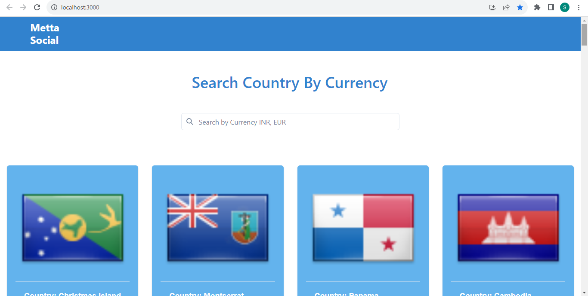
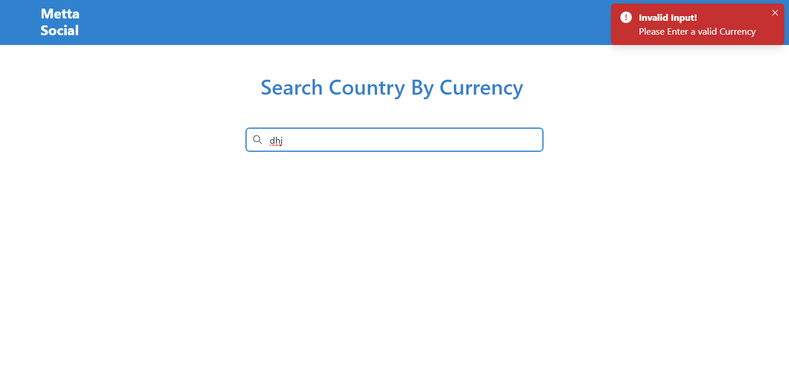

## Deployed Link
This is the deployed link on netlify-https://searchcountryfromcurrency.netlify.app/

1. **Installation**
    - To install the project, follow these steps:
        - Clone the repository using the following command:
            ```bash
            git clone https://github.com/SankethGaniga95/Assignment-metta-social.git
            ```
        - Install the required dependencies:
            ```bash
            npm install
            ```
        - To run the project locally, you can run:
            ```bash
            npm start
            ```
          Runs the app in the development mode.
          Open http://localhost:3000 to view it in your browser.

2. **Description**
    The website is built using React and Chakra UI. The data is being fetched from https://restcountries.com/v3.1/currency/{currency} and for the images of the flags the data is fetched from https://flagsapi.com/#quick.

3. **ScreenShots**
  Search Results 
  
  
  Invalid Search Results
  
